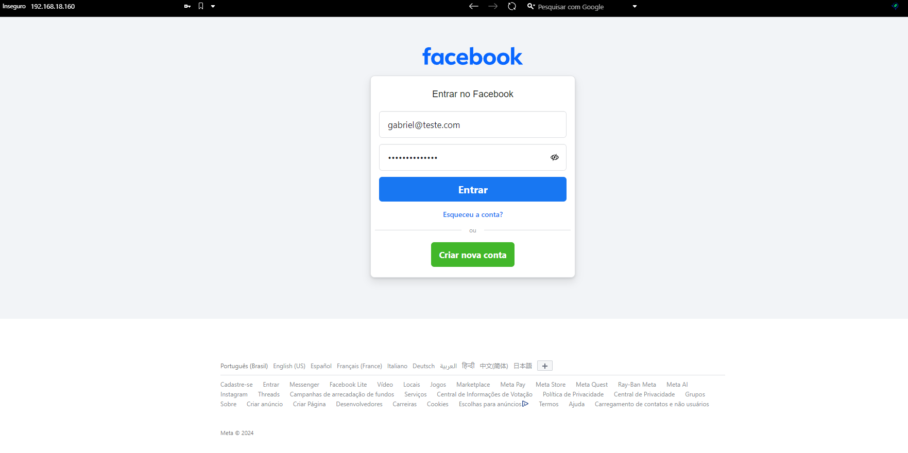

# Phishing-com-o-Kali-Linux
Este repositório é para um desafio de Phishing utilizando o Kali Linux para a captura de credenciais **(usuários e senhas)**

## Ferramenta Utilizada
- **setoolkit**

## Passo a Passo

1. Acesso ao root: Antes de começar, acessar o usuário root com o comando:
   ```bash
   sudo su
   ```
2. Executando o setoolkit no terminal:
   ```bash
   setoolkit
   ```
   Escolha a opção de **Social-Engineering Attacks** no menu principal.
   
3. Selecionando o Vetor de Ataque: **Website Attack Vectors**.

4. Escolhendo o Método: **Credential Harvester Attack Method** e selecione a opção para clonar um site.
   
5. Nisso irá solicitar um IP para ser o servidor "local", podemos dar só enter que irá ser realizado na nossa máquina
   
6. Clonando o Site: Durante o desafio, utilizamos o **Facebook** como exemplo de site a ser clonado. Colocar a URL do site a ser clonado quando solicitado. (http://www.facebook.com)
   
7. E nisso informe as credencias no formulário que está sendo solicitado ao fazer sua requisição, será retornado no terminal
   


OBS: Podemos ter dificuldades na parte de requisição do navegador e ao servidor local, então podemos utilizar o curl:
 ```bash
   curl -X POST -d "email=teste@tste.com&passwordteste2" http://192.168.18.160
   ```
---
